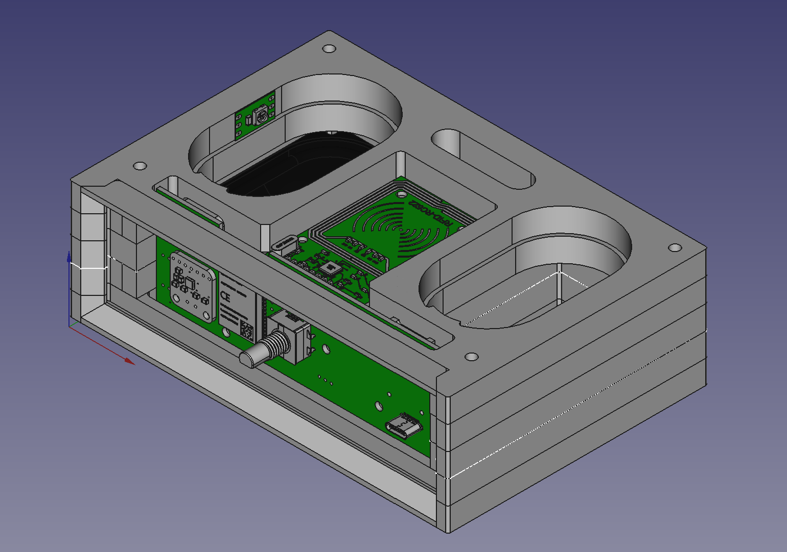
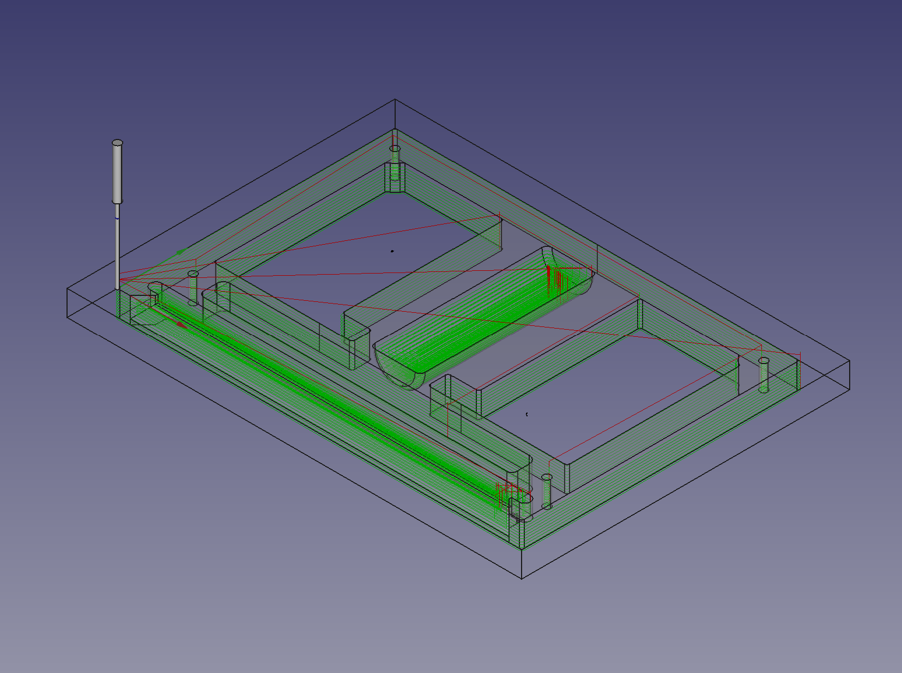
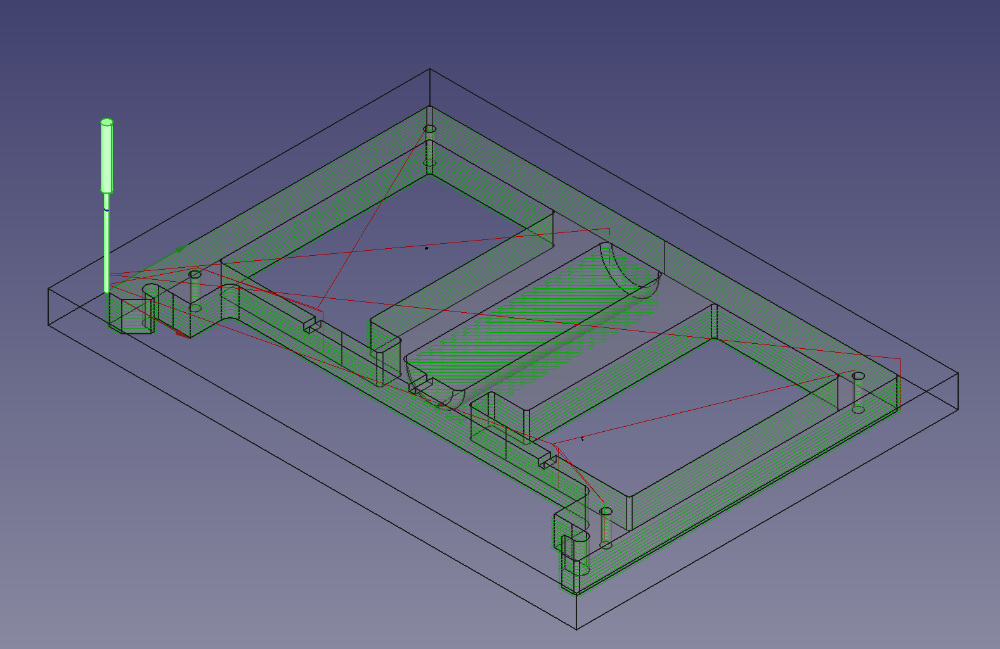
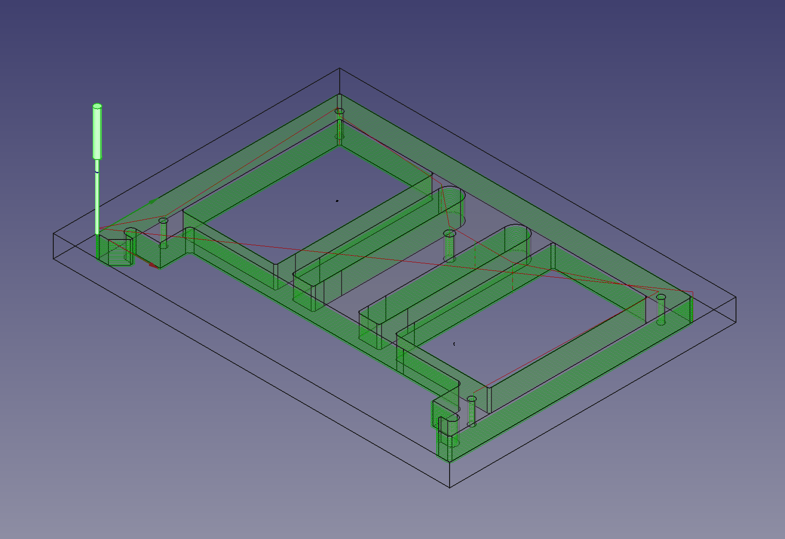
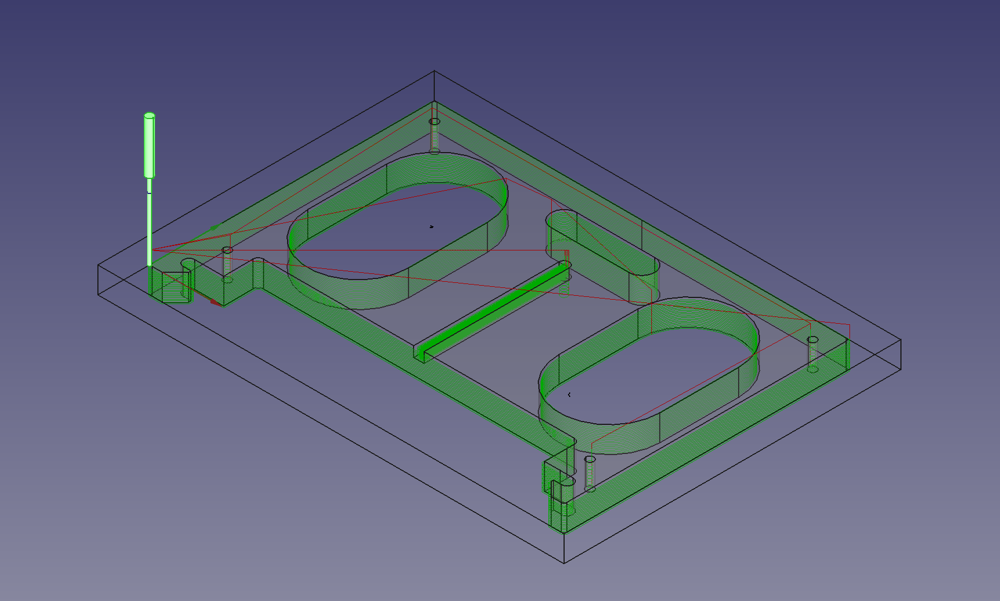
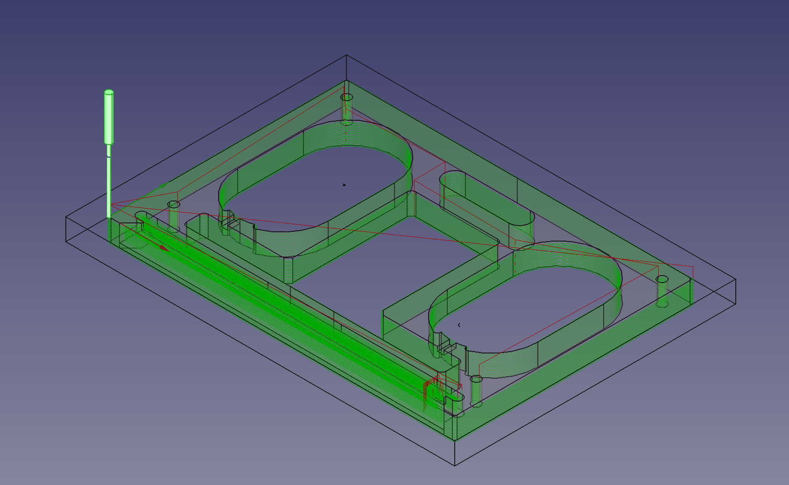
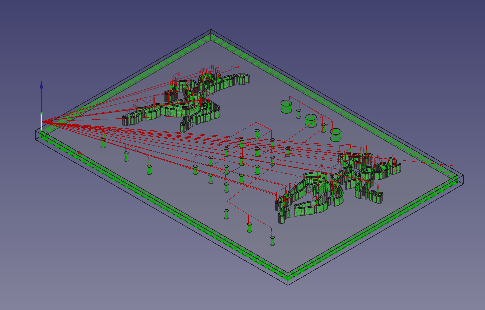
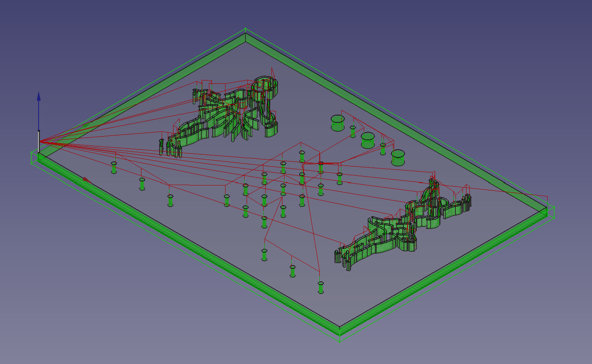
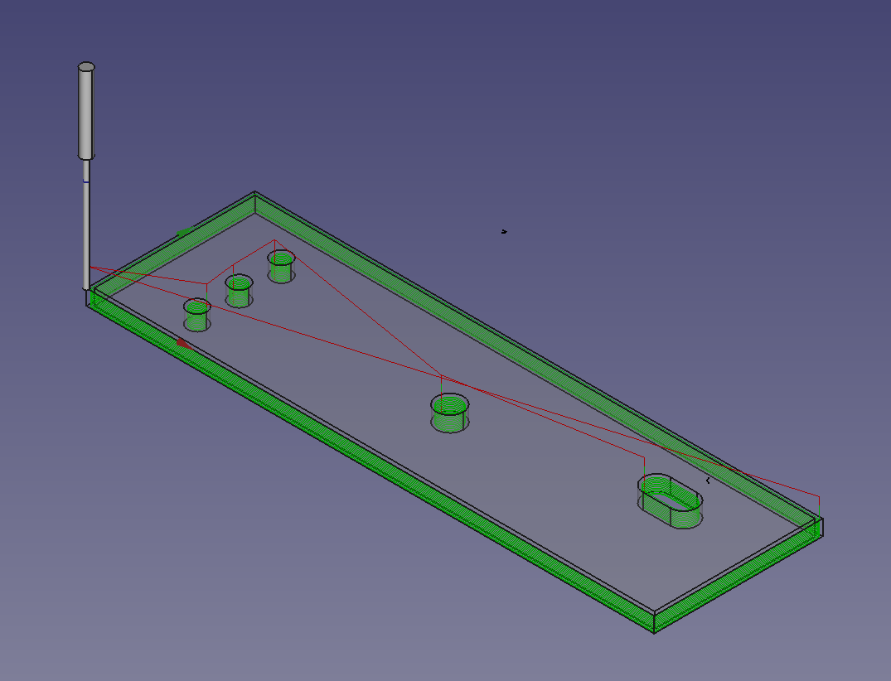
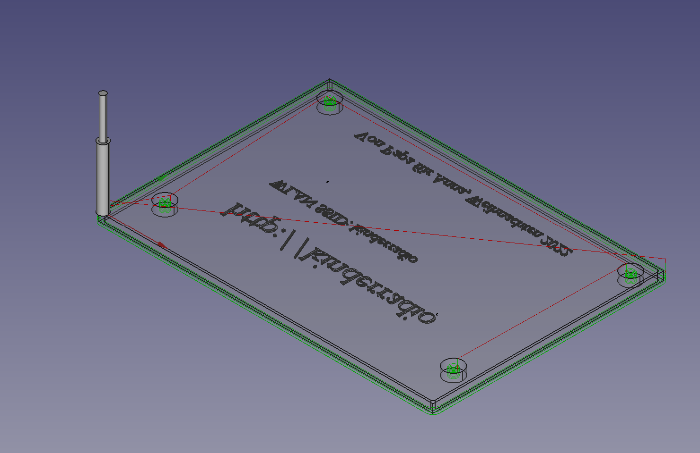

# Mechanic Definition
This page shall give you a help, how to drill the parts and how they are mounted

## Zero-Points
The following pictures shall define the zeroe points of the drill-maschine and the orientation

## Drill Diameter

| Body			| Drill-Diameter	| Size		|
|---------------|-------------------|-----------|
| L0			| 1.4mm				| 10mm		|
| L1			| 1.4mm				| 10mm		|
| L2			| 1.4mm				| 10mm		|
| L3			| 1.4mm				| 10mm		|
| L4			| 1.4mm				| 10mm		|
| ground		| 1.4mm				| 4mm		|
| front-cover	| 1.4mm				| 4mm		|
| cover_boy		| 0.8mm				| 4mm		|
| cover_girl	| 0.8mm				| 4mm		|