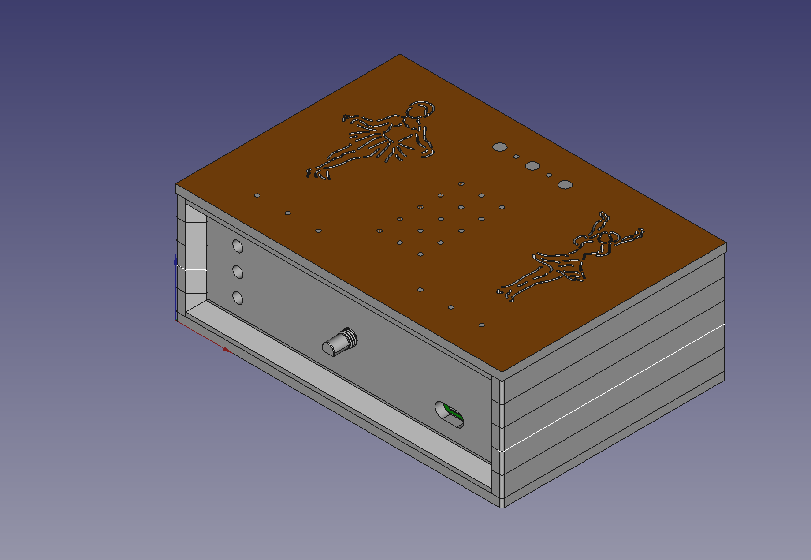

# childradio
An ESP32-based web radio designed specifically for small children.

The mechanics are highly robust, making it the only web radio capable of withstanding the daily life of a 1-year-old child.

## Key-Features:
- Robust Wooden Design: Built to endure rough handling.
- 2x3W Stereo Class-D Amplifier: Provides clear, powerful sound.
- Beautiful Cover: Enhances aesthetics and child-friendliness.
- RGB LED Lighting: Creates an attractive background glow behind the cover.
- Web Server for Parental Control: Parents can manage settings via a web interface.
- Child-Friendly Controls: Only volume adjustment and channel skipping are accessible to the child.
- USB-C Charging Port: Modern, convenient charging.
- Battery-Powered: Runs on a single 18650 cell, ensuring portability.

Please view this video for a demonstration
[Video](Mechanics/02_pics/VID_20241116_003110.mp4)

